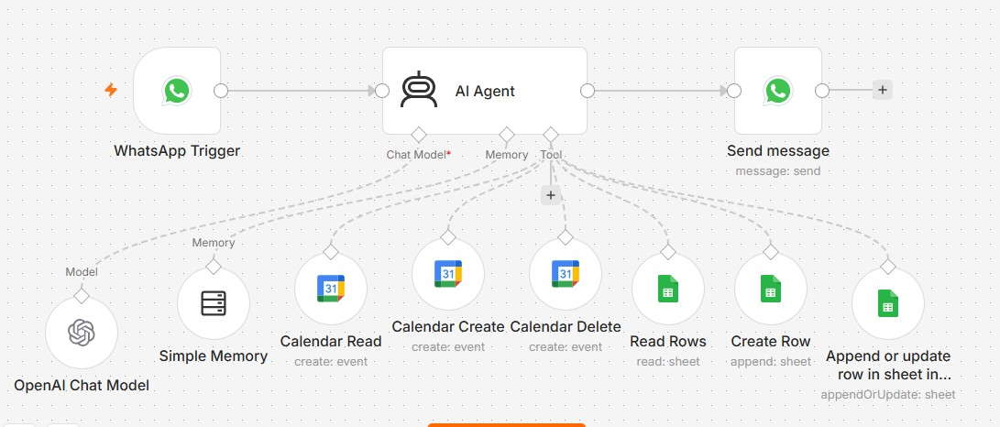

# Appointment Booking Bot 🩺📅

An AI-powered WhatsApp assistant that handles end-to-end appointment booking for **Medical Clinic** — built with **n8n**, **WhatsApp Cloud API**, **Google Calendar**, and **Google Sheets**.

## Overview

Patients message the clinic on WhatsApp and are guided through a natural conversation by an AI agent that:
- Greets them and confirms booking intent
- Collects **email, name, appointment date, and appointment time**
- Reads the clinic's Google Calendar to show real-time available days and time slots
- Confirms details before finalizing
- Books the appointment directly into Google Calendar
- Logs and updates patient records in Google Sheets

No manual back-and-forth with staff — the entire flow, from greeting to confirmed booking, is automated.

## Tech Stack

- **n8n** — workflow orchestration & AI Agent
- **WhatsApp Cloud API (Meta)** — messaging channel
- **Google Calendar API** — read/write appointment slots
- **Google Sheets API** — patient records (add/append rows, matched by email)
- **LLM (via n8n AI Agent node)** — conversation handling & structured data extraction using `$fromAI()`

## How It Works

1. **WhatsApp Trigger** receives an incoming patient message.
2. **AI Agent** manages the conversation — greeting, intent check, and data collection.
3. **Calendar Read** tool fetches existing bookings to determine free slots (max 8/day, 30-min slots, 6 PM–10 PM).
4. Agent presents available **days**, then **time slots**, to the patient.
5. Once confirmed, the agent calls:
   - **Calendar Create** — books the event on Google Calendar
   - **Google Sheets (Add/Append Row)** — saves/updates the patient's record, matched by email
6. Patient receives a confirmation message on WhatsApp.

## Clinic Rules (configurable)

| Setting | Value |
|---|---|
| Operating hours | 6:00 PM – 10:00 PM |
| Slot duration | 30 minutes |
| Max patients/day | 8 |

## Key Design Decisions

- Data is saved **incrementally** (e.g. email is saved the moment it's received) rather than all at once at the end, to avoid losing partial info if a conversation drops off.
- The agent always re-checks **Calendar Read** right before booking to prevent double-booking.
- Structured fields (email, name, date, time, status) are extracted via n8n's `$fromAI()` mapping in each tool node, ensuring clean, consistent data lands in Sheets/Calendar.

## Project Status

Portfolio / demo project — built to showcase AI agent + calendar + spreadsheet automation for a real-world clinic use case.

## Author

**Areeba Aijaz** — Automation Engineer (n8n, AI Agents, Workflow Automation)
