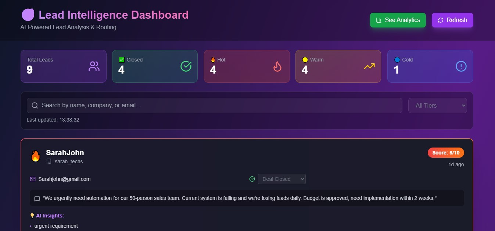
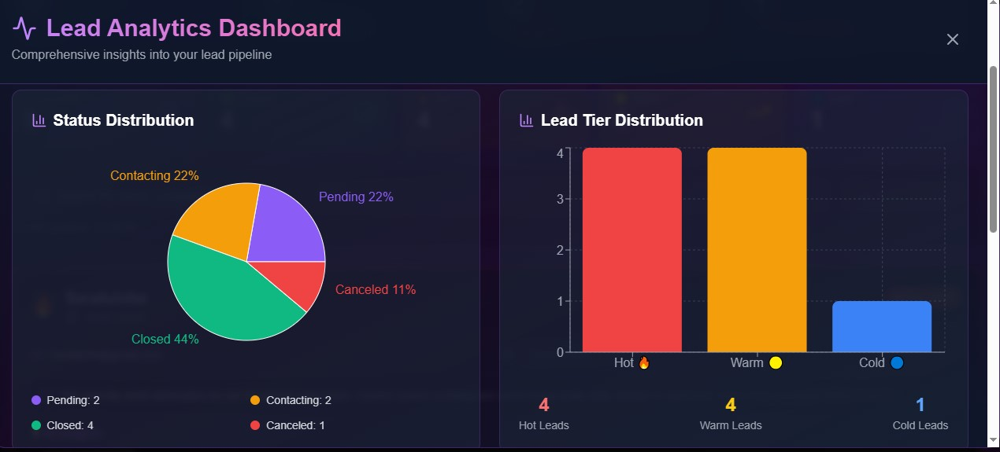
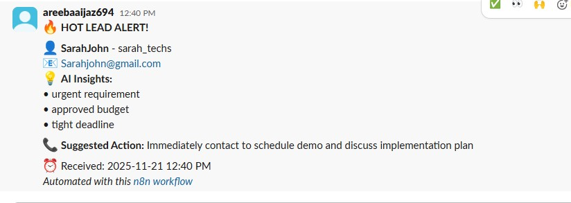

# 🎯 Lead Intelligence System

AI-powered lead management system that captures, analyzes, and routes leads in real-time—reducing response time from hours to seconds.

## 🚀 What It Does

When a potential customer fills out a contact form:
1. **Captures** their information instantly via webhook
2. **Analyzes** their message using OpenAI (scores 1-10)
3. **Detects** urgency signals, budget indicators, and pain points
4. **Alerts** sales team on Slack with AI-generated talking points
5. **Displays** everything on a real-time dashboard with analytics

**Result:** Sales teams respond in seconds instead of hours, never miss hot leads, and know exactly what to say.

---

## ✨ Features

### 🤖 AI-Powered Analysis
- Automatic lead scoring (1-10 scale)
- Urgency detection ("urgent", "ASAP", "budget approved")
- Pain point identification
- Personalized action recommendations

### 📊 Real-Time Dashboard
- Live lead feed with color-coded scores
- AI-generated insights and talking points
- Status tracking (Pending → Contacting → Closed/Canceled)
- Search and filter by tier (Hot/Warm/Cold)

### 📈 Analytics
- Status distribution (Pending, Contacting, Closed, Canceled)
- Lead tier breakdown (Hot, Warm, Cold)
- Score distribution analysis
- Source performance tracking
- Conversion rate metrics

### ⚡ Automation
- Instant Slack notifications for hot leads (score 8+)
- Google Sheets auto-sync
- Status updates synced across all platforms
- Zero manual data entry

---

## 🛠️ Tech Stack

**Automation:** n8n (2 workflows)  
**AI:** OpenAI GPT-4  
**Frontend:** Next.js 14, Tailwind CSS  
**Charts:** Recharts  
**Storage:** Google Sheets  
**Notifications:** Slack API  


---

## ⚙️ Setup Instructions

### 1. Clone Repository
```bash
git clone https://github.com/AreebaAijaz/ai-automation-workflows.git
cd ai-automation-workflows/lead-intelligence
```

### 2. Install Dependencies
```bash
npm install
```

### 3. Configure n8n Workflows

#### Import Workflows:
1. Open n8n
2. Click **Import from File**
3. Select `workflows/lead-intelligence.json`
4. Activate both workflows

#### Workflow 1: Lead Processing
- **Webhook** → Captures form submissions
- **AI Agent (OpenAI)** → Analyzes and scores lead
- **Code** → Formats data
- **Google Sheets** → Saves lead data
- **IF** → Routes by score
- **Slack** → Sends alerts (hot leads get priority)

#### Workflow 2: Dashboard API
- **Webhook (GET)** → Reads all leads from Google Sheets
- **Webhook (POST)** → Updates lead status in Google Sheets

### 4. Set Up Integrations

**Google Sheets:**
1. Create spreadsheet: "Lead Intelligence Database"
2. Add columns: `id, timestamp, name, email, company, message, source, score, tier, insights, red_flags, suggested_action, status, assigned_to`
3. Connect n8n to your sheet

**Slack:**
1. Create Slack webhook URL
2. Add to n8n Slack nodes
3. Create channel: `#hot-leads`

**OpenAI:**
1. Get API key from OpenAI
2. Add to n8n AI Agent node
3. Use model: `gpt-4` or `gpt-3.5-turbo`

### 5. Update Dashboard URLs

In `src/app/components/homepage.js`, update:
```javascript
const API_URL = 'YOUR_N8N_WEBHOOK_URL/webhook/get-leads';
```

### 6. Run Development Server
```bash
npm run dev
```

Visit: `http://localhost:3000`


## 🎯 How It Works

### Lead Capture Flow
```
Google Form → n8n Webhook → OpenAI Analysis → Google Sheets → Slack Alert → Dashboard
```

### Data Flow
```
User fills form
    ↓
Webhook captures (< 1 sec)
    ↓
AI analyzes message (3-5 sec)
    ↓
Scores 1-10 + generates insights
    ↓
Saves to Google Sheets
    ↓
IF score >= 8 → Urgent Slack alert
IF score < 8 → Standard notification
    ↓
Dashboard displays with AI insights
    ↓
User changes status → POST to n8n → Updates Google Sheets
```

---

## 📊 Live Demo

**Dashboard:** https://leadintelligencedashboard.vercel.app/

**Test Form:** https://forms.gle/oajx3cHpXbNdp4Da9

Fill out the form and watch your submission appear on the dashboard with AI analysis in real-time!

---

## 🎨 Screenshots

### Dashboard


### Analytics


### Slack Notification


---

## 📈 Performance

- **Lead capture:** < 1 second
- **AI analysis:** 3-5 seconds
- **Total processing:** < 10 seconds
- **Dashboard refresh:** Real-time
- **Status sync:** Instant

---


## 💬 Questions?

Open an issue or reach out! Happy to help fellow learners. 🚀

---

**⭐ If you found this helpful, please star the repo!**
