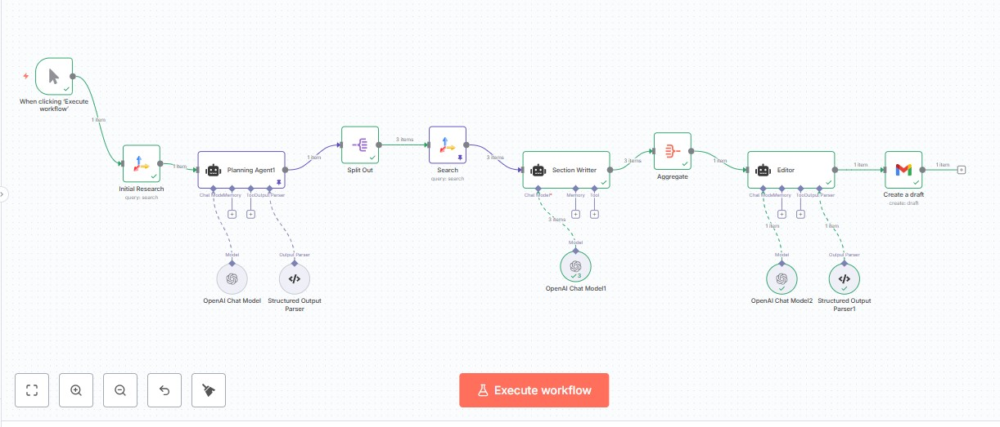

# AI-Powered Newsletter Automation

An n8n workflow that autonomously researches, writes, and drafts professional newsletters using AI agents and web search APIs.

## Overview

This workflow automates the entire newsletter creation process through a multi-agent pipeline:

1. **Research** → Gathers recent news and articles from your niche
2. **Planning** → AI agent generates edition title and identifies 3 key topics
3. **Deep Research** → Searches detailed sources for each topic
4. **Content Creation** → AI agent writes individual sections with citations
5. **Editorial** → AI agent compiles, formats, and styles into responsive HTML
6. **Draft Generation** → Creates a Gmail draft ready for review




## Architecture

```
Schedule Trigger
  → Initial Research (Tavily)
    → Planning Agent (title + topics)
      → Split Topics
        → Topic Research (Tavily)
          → Section Writer Agent
            → Aggregate Sections
              → Editor Agent (HTML output)
                → Gmail Draft
```

## Prerequisites

- **n8n** (cloud or self-hosted)
- **Tavily API** for web search functionality
- **OpenAI API** (or alternative LLM provider)
- **Gmail OAuth** for draft creation
- Community Nodes enabled in n8n settings

## Key Features

- **Automated Scheduling** – Runs weekly without manual intervention
- **Structured Output** – JSON schemas ensure consistent agent responses
- **Citation Management** – Inline source attribution with deduplicated references
- **Responsive HTML** – Professional email formatting with inline CSS
- **Quality Control** – Human review via Gmail draft before sending


## Output

The workflow produces a complete newsletter draft including:
- Compelling subject line
- Structured HTML body with header, intro, sections, and sources
- Mobile-responsive design with inline CSS
- Proper link hygiene
  
---


## 🚀 Getting Started

1. **Download** the `Newsletter.json` file from this repository
2. Open your **n8n instance** (cloud or self-hosted at http://localhost:5678)
3. Click **"Workflows"** → **"Import from File"**
4. Select the downloaded JSON file and click **"Import"**
5. The workflow will open with nodes that may show warning icons
6. Configure the required credentials (see below)
7. Click **"Execute Workflow"** to test

### 🔑 Required Credentials

Before testing, you'll need to set up:
- **OpenAI API Key**
- **Tavily API Key**
- **Gmail Account** 

